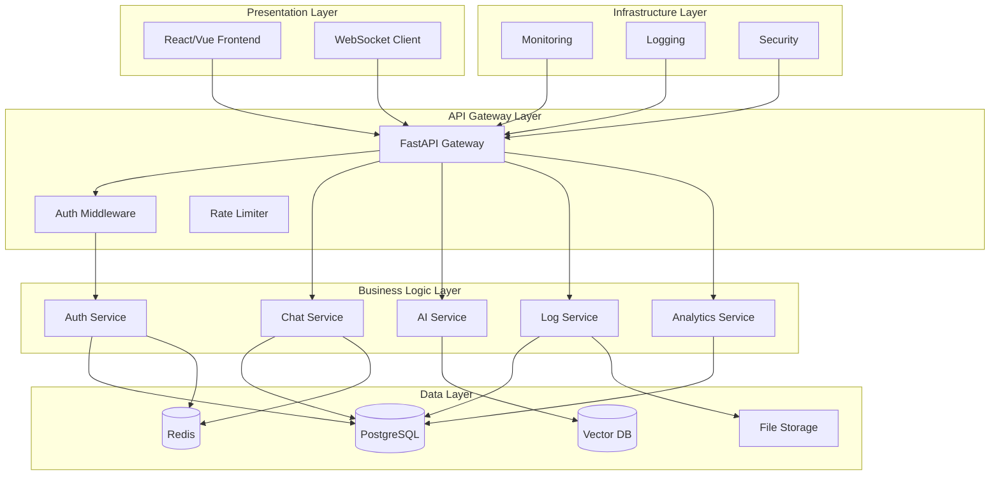
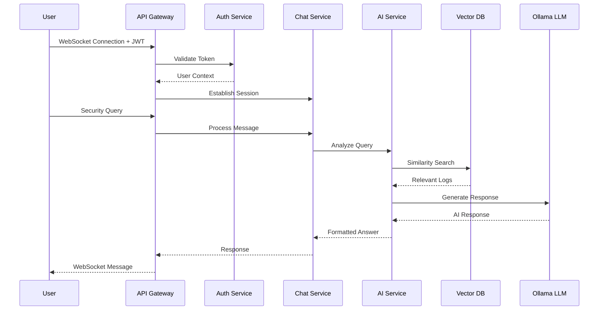

# Design Document

## Overview

This design transforms the monolithic Wazuh AI Companion chatbot into a production-ready, microservices-based security analysis platform. The architecture follows a layered approach with clear separation of concerns, enabling independent scaling, deployment, and maintenance of each component while preserving all existing functionality and adding enterprise-grade features.

The system will maintain the core AI-powered threat hunting capabilities while introducing proper authentication, persistent storage, comprehensive monitoring, and container-based deployment suitable for enterprise environments.

## Architecture

### High-Level Architecture



### Service Architecture

The system follows a microservices pattern with the following core services:

1. **API Gateway Service**: Central entry point handling routing, authentication, and rate limiting
2. **Authentication Service**: User management, JWT tokens, and RBAC
3. **Chat Service**: WebSocket management and conversation handling
4. **AI Service**: LangChain integration, embeddings, and LLM processing
5. **Log Service**: Wazuh log parsing, processing, and storage
6. **Analytics Service**: Usage metrics, reporting, and dashboards

### Data Flow Architecture



## Components and Interfaces

### 1. API Gateway (FastAPI)

**Purpose**: Central entry point for all client requests

**Key Components**:
- HTTP/WebSocket routing
- Authentication middleware
- Rate limiting and throttling
- Input validation and sanitization
- CORS handling

**Interfaces**:
```python
# API Routes
GET /api/v1/health
POST /api/v1/auth/login
POST /api/v1/auth/logout
GET /api/v1/auth/me
WebSocket /ws/chat
GET /api/v1/logs/stats
POST /api/v1/logs/reload
GET /api/v1/analytics/dashboard
```

### 2. Authentication Service

**Purpose**: User management and security

**Key Components**:
- JWT token generation and validation
- Password hashing (bcrypt)
- Role-based access control
- Session management with Redis
- User CRUD operations

**Interfaces**:
```python
class AuthService:
    def authenticate_user(username: str, password: str) -> User
    def create_access_token(user: User) -> str
    def validate_token(token: str) -> User
    def check_permissions(user: User, resource: str) -> bool
    def create_user(user_data: UserCreate) -> User
```

### 3. Chat Service

**Purpose**: WebSocket management and conversation handling

**Key Components**:
- WebSocket connection management
- Chat session persistence
- Message history storage
- Command processing (/help, /reload, /stat)
- Real-time message broadcasting

**Interfaces**:
```python
class ChatService:
    def handle_connection(websocket: WebSocket, user: User)
    def process_message(message: str, session: ChatSession) -> str
    def save_message(message: Message, session: ChatSession)
    def get_chat_history(session_id: str) -> List[Message]
    def execute_command(command: str, session: ChatSession) -> str
```

### 4. AI Service

**Purpose**: AI/ML processing and LLM integration

**Key Components**:
- LangChain integration
- Vector embeddings generation
- FAISS vector store management
- Ollama LLM communication
- Query processing and response generation

**Interfaces**:
```python
class AIService:
    def initialize_vectorstore(logs: List[Dict]) -> FAISS
    def generate_embeddings(text: str) -> List[float]
    def similarity_search(query: str, k: int = 5) -> List[Document]
    def generate_response(query: str, context: List[Document]) -> str
    def update_vectorstore(new_logs: List[Dict])
```

### 5. Log Service

**Purpose**: Wazuh log processing and management

**Key Components**:
- Log file parsing (JSON/compressed)
- Remote log access via SSH
- Log validation and cleaning
- Metadata extraction and storage
- Date range filtering

**Interfaces**:
```python
class LogService:
    def load_logs_from_days(days: int) -> List[Dict]
    def load_remote_logs(host: str, credentials: SSHCredentials) -> List[Dict]
    def parse_log_file(file_path: str) -> List[Dict]
    def validate_log_entry(log: Dict) -> bool
    def get_log_statistics(logs: List[Dict]) -> LogStats
```

### 6. Analytics Service

**Purpose**: Metrics collection and reporting

**Key Components**:
- Usage metrics collection
- Performance monitoring
- Dashboard data aggregation
- Report generation
- Trend analysis

**Interfaces**:
```python
class AnalyticsService:
    def track_user_query(user_id: str, query: str, response_time: float)
    def get_usage_metrics(date_range: DateRange) -> UsageMetrics
    def generate_dashboard_data() -> DashboardData
    def create_performance_report() -> PerformanceReport
    def analyze_query_patterns() -> QueryPatterns
```

## Data Models

### User Management

```python
class User(BaseModel):
    id: UUID
    username: str
    email: str
    password_hash: str
    role: UserRole  # ADMIN, ANALYST, VIEWER
    is_active: bool
    created_at: datetime
    last_login: datetime

class ChatSession(BaseModel):
    id: UUID
    user_id: UUID
    created_at: datetime
    updated_at: datetime
    is_active: bool

class Message(BaseModel):
    id: UUID
    session_id: UUID
    role: MessageRole  # USER, ASSISTANT, SYSTEM
    content: str
    timestamp: datetime
    metadata: Dict[str, Any]
```

### Log Management

```python
class LogEntry(BaseModel):
    id: UUID
    timestamp: datetime
    source: str
    level: str
    full_log: str
    parsed_data: Dict[str, Any]
    embedding_id: Optional[str]

class LogStats(BaseModel):
    total_logs: int
    date_range: DateRange
    sources: Dict[str, int]
    levels: Dict[str, int]
    processing_time: float
```

### Analytics

```python
class QueryMetrics(BaseModel):
    user_id: UUID
    query: str
    response_time: float
    timestamp: datetime
    success: bool
    error_message: Optional[str]

class UsageMetrics(BaseModel):
    total_queries: int
    unique_users: int
    avg_response_time: float
    error_rate: float
    peak_usage_time: datetime
```

## Error Handling

### Exception Hierarchy

```python
class WazuhChatException(Exception):
    """Base exception for all application errors"""
    pass

class AuthenticationError(WazuhChatException):
    """Authentication and authorization errors"""
    pass

class ValidationError(WazuhChatException):
    """Input validation errors"""
    pass

class ServiceUnavailableError(WazuhChatException):
    """Service dependency errors"""
    pass

class AIProcessingError(WazuhChatException):
    """AI/ML processing errors"""
    pass
```

### Error Response Format

```python
class ErrorResponse(BaseModel):
    error_code: str
    message: str
    details: Optional[Dict[str, Any]]
    timestamp: datetime
    request_id: str
```

### Error Handling Strategy

1. **API Level**: Global exception handlers with proper HTTP status codes
2. **Service Level**: Service-specific error handling with logging
3. **Database Level**: Connection pooling and retry mechanisms
4. **External Services**: Circuit breaker pattern for Ollama/SSH connections
5. **WebSocket Level**: Graceful connection handling and reconnection logic

## Testing Strategy

### Unit Testing

- **Coverage Target**: 80% minimum code coverage
- **Framework**: pytest with pytest-asyncio for async code
- **Mocking**: Mock external dependencies (Ollama, SSH, databases)
- **Test Structure**: Arrange-Act-Assert pattern

```python
# Example unit test structure
class TestAuthService:
    def test_authenticate_valid_user(self):
        # Arrange
        auth_service = AuthService()
        user_data = {"username": "test", "password": "password"}
        
        # Act
        result = auth_service.authenticate_user(**user_data)
        
        # Assert
        assert result.username == "test"
        assert result.is_authenticated
```

### Integration Testing

- **API Testing**: FastAPI TestClient for endpoint testing
- **Database Testing**: Test database with fixtures
- **Service Integration**: Test service-to-service communication
- **WebSocket Testing**: WebSocket connection and message flow testing

### End-to-End Testing

- **User Workflows**: Complete user journey testing
- **Browser Testing**: Selenium/Playwright for UI testing
- **Performance Testing**: Load testing with locust
- **Security Testing**: OWASP ZAP integration

### Test Data Management

- **Fixtures**: Reusable test data sets
- **Factories**: Dynamic test data generation
- **Cleanup**: Automatic test data cleanup
- **Isolation**: Test isolation and parallel execution

## Security Considerations

### Authentication & Authorization

- **JWT Tokens**: Short-lived access tokens with refresh token rotation
- **Password Security**: bcrypt hashing with salt rounds
- **Role-Based Access**: Granular permissions per endpoint
- **Session Management**: Redis-based session storage with TTL

### Data Protection

- **Encryption in Transit**: TLS 1.3 for all communications
- **Encryption at Rest**: Database encryption for sensitive data
- **Input Sanitization**: Comprehensive input validation and sanitization
- **SQL Injection Prevention**: Parameterized queries and ORM usage

### Infrastructure Security

- **Container Security**: Minimal base images and security scanning
- **Network Security**: Network policies and service mesh
- **Secrets Management**: External secret management (HashiCorp Vault)
- **Audit Logging**: Comprehensive audit trail for compliance

### Security Headers

```python
# Security middleware configuration
SECURITY_HEADERS = {
    "X-Content-Type-Options": "nosniff",
    "X-Frame-Options": "DENY",
    "X-XSS-Protection": "1; mode=block",
    "Strict-Transport-Security": "max-age=31536000; includeSubDomains",
    "Content-Security-Policy": "default-src 'self'"
}
```

This design provides a robust foundation for transforming the monolithic chatbot into a production-ready, scalable security platform while maintaining all existing functionality and adding enterprise-grade capabilities.