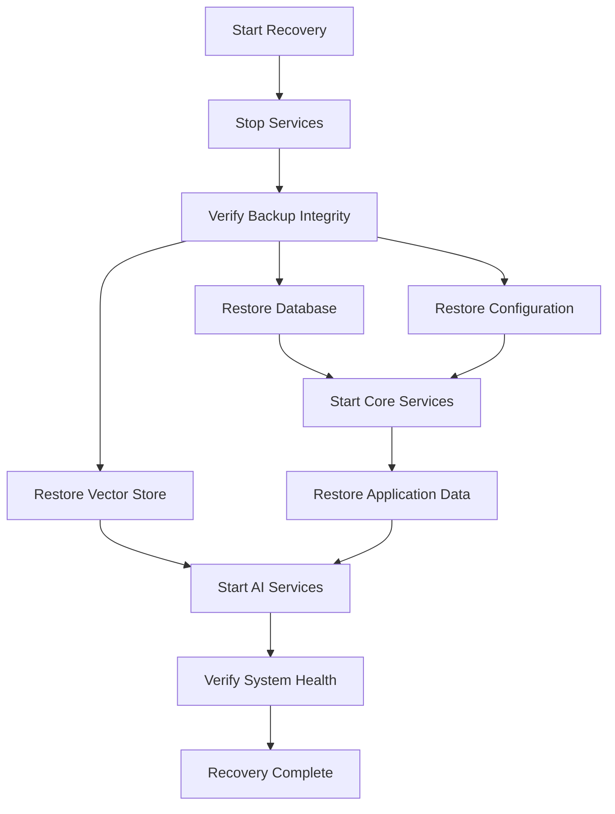

# Wazuh AI Companion - Disaster Recovery Guide

This document provides comprehensive disaster recovery procedures for the embedded AI security appliance.

This document provides comprehensive disaster recovery procedures for the Wazuh AI Companion system, including backup strategies, recovery procedures, and business continuity planning.

## Table of Contents

1. [Overview](#overview)
2. [Recovery Objectives](#recovery-objectives)
3. [Backup Strategy](#backup-strategy)
4. [Recovery Procedures](#recovery-procedures)
5. [Testing and Validation](#testing-and-validation)
6. [Emergency Contacts](#emergency-contacts)
7. [Troubleshooting](#troubleshooting)

## Overview

### System Architecture

The Wazuh AI Companion consists of the following critical components:

- **Application Server**: FastAPI application with AI/ML capabilities
- **Database**: PostgreSQL for structured data storage
- **Cache**: Redis for session and cache management
- **AI Models**: Embedded LlamaCpp engine with local models and vector embeddings
- **Monitoring**: Prometheus, Grafana, and Alertmanager
- **Reverse Proxy**: Nginx for load balancing and SSL termination

### Disaster Scenarios

This guide covers recovery from the following disaster scenarios:

1. **Hardware Failure**: Server hardware malfunction or failure
2. **Data Corruption**: Database or file system corruption
3. **Security Incident**: Ransomware, data breach, or unauthorized access
4. **Natural Disaster**: Fire, flood, earthquake, or other natural events
5. **Human Error**: Accidental deletion or misconfiguration
6. **Software Failure**: Application bugs or dependency issues

## Recovery Objectives

### Recovery Point Objective (RPO)

- **Critical Data**: 1 hour maximum data loss
- **Configuration**: 24 hours maximum data loss
- **Monitoring Data**: 4 hours maximum data loss

### Recovery Time Objective (RTO)

- **Critical Services**: 4 hours maximum downtime
- **Full System**: 8 hours maximum downtime
- **Monitoring Services**: 2 hours maximum downtime

### Service Priority Levels

1. **Critical (P1)**: Database, Application Server, Authentication
2. **High (P2)**: Redis Cache, AI Services
3. **Medium (P3)**: Monitoring, Alerting
4. **Low (P4)**: Historical Data, Logs

## Backup Strategy

### Backup Types

#### Full Backup
- **Frequency**: Daily at 2:00 AM
- **Components**: All data, configurations, and volumes
- **Retention**: 30 days local, 90 days offsite
- **Size**: ~5-10 GB (varies with data volume)

#### Incremental Backup
- **Frequency**: Every 6 hours
- **Components**: Changed data only
- **Retention**: 7 days
- **Size**: ~100-500 MB

#### Configuration Backup
- **Frequency**: After any configuration change
- **Components**: Docker Compose files, configurations
- **Retention**: 90 days
- **Size**: ~10-50 MB

### Backup Locations

#### Primary Location
- **Path**: `/backups` on production server
- **Storage**: Local SSD storage
- **Capacity**: 500 GB
- **Access**: Direct file system access

#### Secondary Location
- **Path**: `/backups/offsite` on backup server
- **Storage**: Network-attached storage
- **Capacity**: 2 TB
- **Access**: SSH/rsync

#### Cloud Storage
- **Provider**: AWS S3
- **Bucket**: `wazuh-ai-companion-backups`
- **Storage Class**: Standard-IA for recent, Glacier for archive
- **Encryption**: AES-256 server-side encryption

### Backup Verification

All backups are automatically verified using:
- **Checksum Validation**: SHA-256 checksums for all files
- **Integrity Testing**: Database restore tests
- **Size Validation**: Expected file size ranges
- **Manifest Creation**: JSON manifest with metadata

## Recovery Procedures

### Pre-Recovery Checklist

Before starting any recovery procedure:

1. **Assess the Situation**
   - Identify the scope of the disaster
   - Determine which components are affected
   - Estimate the recovery time required

2. **Notify Stakeholders**
   - Inform management and users
   - Activate incident response team
   - Document the incident

3. **Secure the Environment**
   - Isolate affected systems if security incident
   - Preserve evidence if required
   - Ensure recovery environment is safe

4. **Prepare Recovery Environment**
   - Verify backup integrity
   - Ensure sufficient resources
   - Test network connectivity

### Complete System Recovery

Use this procedure for total system failure or major disasters.

#### Step 1: Environment Preparation

```bash
# 1. Set up new server or clean existing server
sudo apt update && sudo apt upgrade -y

# 2. Install Docker and Docker Compose
curl -fsSL https://get.docker.com -o get-docker.sh
sudo sh get-docker.sh
sudo usermod -aG docker $USER

# 3. Install Docker Compose
sudo curl -L "https://github.com/docker/compose/releases/latest/download/docker-compose-$(uname -s)-$(uname -m)" -o /usr/local/bin/docker-compose
sudo chmod +x /usr/local/bin/docker-compose

# 4. Clone application repository
git clone https://github.com/your-username/wazuh-ai.git
cd wazuh-ai
```

#### Step 2: Restore from Backup

```bash
# 1. List available backups
python3 scripts/recovery.py list --backup-dir /path/to/backups

# 2. Verify backup integrity
python3 scripts/recovery.py verify --timestamp 20240131_020000 --backup-dir /path/to/backups

# 3. Perform full recovery
python3 scripts/recovery.py restore \
  --timestamp 20240131_020000 \
  --components postgres redis vectorstore volumes configuration \
  --backup-dir /path/to/backups \
  --compose-file docker-compose.prod.yml
```

#### Step 3: Verify Recovery

```bash
# 1. Check service status
docker-compose -f docker-compose.prod.yml ps

# 2. Test application health
curl http://localhost:8000/health

# 3. Test detailed health check
curl http://localhost:8000/health/detailed

# 4. Verify data integrity
python3 scripts/test-deployment.py
```

### Partial Recovery Procedures

#### Database Recovery Only

```bash
# 1. Stop application services
docker-compose -f docker-compose.prod.yml stop app

# 2. Restore database
python3 scripts/recovery.py restore \
  --timestamp 20240131_020000 \
  --components postgres \
  --backup-dir /path/to/backups

# 3. Start application services
docker-compose -f docker-compose.prod.yml start app
```

#### Configuration Recovery Only

```bash
# 1. Backup current configuration
cp -r . /tmp/current-config-backup

# 2. Restore configuration
python3 scripts/recovery.py restore \
  --timestamp 20240131_020000 \
  --components configuration \
  --backup-dir /path/to/backups

# 3. Review and merge configurations
# Manual step: Review restored configs and merge with current settings

# 4. Restart services with new configuration
docker-compose -f docker-compose.prod.yml down
docker-compose -f docker-compose.prod.yml up -d
```

#### Vector Store Recovery

```bash
# 1. Stop AI services
docker-compose -f docker-compose.prod.yml stop app

# 2. Restore vector store using recovery script
python3 scripts/recovery.py restore \
  --timestamp 20240131_020000 \
  --components vectorstore \
  --backup-dir /path/to/backups

# 3. Alternative: Direct vector store restore using embedded AI service
python3 -c "
from services.embedded_ai_service import EmbeddedAIService
ai_service = EmbeddedAIService()
result = ai_service.restore_vectorstore_from_path('/path/to/backups', 'default')
print('Restore successful:', result)
"

# 4. Verify vector store integrity
python3 -c "
from services.embedded_ai_service import EmbeddedAIService
ai_service = EmbeddedAIService()
verification = ai_service.verify_vectorstore_backup('/path/to/backups', 'default')
print('Verification result:', verification)
"

# 5. Start AI services
docker-compose -f docker-compose.prod.yml start app
```

#### Vector Store Backup Verification

Before performing recovery, always verify backup integrity:

```bash
# Verify specific backup
python3 -c "
from services.embedded_ai_service import EmbeddedAIService
ai_service = EmbeddedAIService()
result = ai_service.verify_vectorstore_backup('/backups', 'default')
if result['valid']:
    print('✅ Backup is valid')
    if result['warnings']:
        print('⚠️ Warnings:', result['warnings'])
else:
    print('❌ Backup is invalid:', result['errors'])
"

# List available vector store backups
ls -la /backups/vectorstore_backup_manifest_*.json
```

### Cloud Recovery Procedures

#### Restore from AWS S3

```bash
# 1. Install AWS CLI
pip install awscli

# 2. Configure AWS credentials
aws configure

# 3. Download backup from S3
aws s3 sync s3://wazuh-ai-companion-backups/2024/01/31/ /tmp/s3-backups/

# 4. Restore using local backup procedures
python3 scripts/recovery.py restore \
  --timestamp 20240131_020000 \
  --backup-dir /tmp/s3-backups
```

### Recovery Time Estimates

| Component | Recovery Time | Dependencies | Critical Path |
|-----------|---------------|--------------|---------------|
| Database | 30-60 minutes | Backup size, hardware | Yes |
| Application | 15-30 minutes | Docker images, configuration | Yes |
| Vector Store | 45-90 minutes | Vector data size | No |
| Configuration | 5-15 minutes | File count, complexity | Yes |
| Full System | 2-4 hours | All components, testing | Yes |
| Monitoring | 10-20 minutes | Configuration complexity | No |

### Recovery Dependencies



## Testing and Validation

### Automated Testing Framework

The system includes comprehensive automated testing for backup and recovery procedures:

```bash
# Run all backup and recovery tests
python3 scripts/test-backup-recovery.py

# Run specific test categories
python3 scripts/test-backup-recovery.py --test-case vector-backup
python3 scripts/test-backup-recovery.py --test-case disaster-recovery

# Run with verbose output and keep test data for debugging
python3 scripts/test-backup-recovery.py --verbose --keep-test-data
```

### Monthly Recovery Testing

Perform monthly recovery tests to ensure backup and recovery procedures work correctly.

#### Test Schedule

- **Week 1**: Database recovery test + Vector store backup test
- **Week 2**: Configuration recovery test + Backup verification test
- **Week 3**: Full system recovery test + Disaster recovery scenario
- **Week 4**: Cloud backup recovery test + Performance testing

#### Test Procedure

```bash
# 1. Run comprehensive backup and recovery tests
python3 scripts/test-backup-recovery.py --verbose

# 2. Create test environment (if running manual tests)
docker-compose -f docker-compose.test.yml up -d

# 3. Populate with test data
python3 scripts/generate-test-data.py

# 4. Create backup
python3 scripts/backup.py --config backup-config.yaml

# 5. Simulate disaster (stop services, remove data)
docker-compose -f docker-compose.test.yml down -v

# 6. Perform recovery
python3 scripts/recovery.py restore --timestamp $(date +%Y%m%d_%H%M%S)

# 7. Validate recovery
python3 scripts/test-deployment.py

# 8. Run post-recovery validation
python3 scripts/test-backup-recovery.py --test-case verification

# 9. Document results
echo "Recovery test completed: $(date)" >> recovery-test.log
```

#### Automated Test Results

The test framework generates comprehensive reports including:

- **Test Execution Summary**: Pass/fail rates and timing
- **Component-Specific Results**: Individual test outcomes
- **Performance Metrics**: Backup/restore timing and throughput
- **Error Analysis**: Detailed failure information
- **Recommendations**: Suggested improvements based on test results

### Backup Validation

#### Automated Validation

```bash
# Daily backup validation script
#!/bin/bash
BACKUP_DIR="/backups"
LATEST_BACKUP=$(ls -t $BACKUP_DIR/backup_manifest_*.json | head -1)

if [ -f "$LATEST_BACKUP" ]; then
    TIMESTAMP=$(basename "$LATEST_BACKUP" | sed 's/backup_manifest_\(.*\)\.json/\1/')
    python3 scripts/recovery.py verify --timestamp "$TIMESTAMP" --backup-dir "$BACKUP_DIR"
    
    if [ $? -eq 0 ]; then
        echo "✅ Backup validation successful: $TIMESTAMP"
    else
        echo "❌ Backup validation failed: $TIMESTAMP"
        # Send alert
        curl -X POST -H 'Content-type: application/json' \
            --data '{"text":"Backup validation failed for '$TIMESTAMP'"}' \
            $SLACK_WEBHOOK_URL
    fi
else
    echo "❌ No backup manifest found"
fi
```

#### Manual Validation Checklist

- [ ] Backup files exist and are not corrupted
- [ ] Checksums match expected values
- [ ] File sizes are within expected ranges
- [ ] Database backup can be restored successfully
- [ ] Configuration files are complete
- [ ] Vector store data is intact

## Emergency Contacts

### Primary Contacts

| Role | Name | Phone | Email | Availability |
|------|------|-------|-------|--------------|
| System Administrator | [Name] | [Phone] | [Email] | 24/7 |
| Database Administrator | [Name] | [Phone] | [Email] | Business Hours |
| Security Officer | [Name] | [Phone] | [Email] | 24/7 |
| Management | [Name] | [Phone] | [Email] | Business Hours |

### Vendor Contacts

| Service | Contact | Phone | Email | Support Level |
|---------|---------|-------|-------|---------------|
| Cloud Provider (AWS) | AWS Support | [Phone] | [Email] | Business |
| Hosting Provider | [Provider] | [Phone] | [Email] | 24/7 |
| Monitoring Service | [Service] | [Phone] | [Email] | Business |

### Escalation Procedures

1. **Level 1**: System Administrator (0-30 minutes)
2. **Level 2**: Database Administrator + Security Officer (30-60 minutes)
3. **Level 3**: Management + Vendor Support (60+ minutes)

## Troubleshooting

### Common Recovery Issues

#### Database Recovery Fails

**Symptoms**: PostgreSQL restore command fails or database won't start

**Possible Causes**:
- Corrupted backup file
- Insufficient disk space
- Version mismatch
- Permission issues

**Solutions**:
```bash
# Check backup file integrity
python3 scripts/recovery.py verify --timestamp [TIMESTAMP]

# Check disk space
df -h

# Check PostgreSQL logs
docker-compose logs postgres

# Try alternative backup
python3 scripts/recovery.py list
python3 scripts/recovery.py restore --timestamp [ALTERNATIVE_TIMESTAMP]
```

#### Docker Volume Recovery Fails

**Symptoms**: Volume restore command fails or data is missing

**Possible Causes**:
- Volume in use by running container
- Insufficient permissions
- Corrupted backup archive

**Solutions**:
```bash
# Stop all containers
docker-compose down

# Remove problematic volume
docker volume rm [VOLUME_NAME]

# Retry recovery
python3 scripts/recovery.py restore --components volumes
```

#### Application Won't Start After Recovery

**Symptoms**: Application container exits or health checks fail

**Possible Causes**:
- Configuration mismatch
- Missing environment variables
- Database connection issues
- Port conflicts

**Solutions**:
```bash
# Check application logs
docker-compose logs app

# Verify configuration
docker-compose config

# Test database connectivity
docker-compose exec app python -c "from core.database import engine; print(engine.execute('SELECT 1').scalar())"

# Restart services
docker-compose restart
```

### Recovery Validation Failures

#### Health Check Failures

```bash
# Check individual service health
curl http://localhost:8000/health/database
curl http://localhost:8000/health/redis
curl http://localhost:8000/health/ai_service

# Check service logs
docker-compose logs [SERVICE_NAME]

# Restart specific service
docker-compose restart [SERVICE_NAME]
```

#### Data Integrity Issues

```bash
# Verify database integrity
docker-compose exec postgres psql -U postgres -d wazuh_chat -c "SELECT COUNT(*) FROM users;"

# Check vector store integrity
python3 -c "
from services.embedded_ai_service import EmbeddedAIService
import os
ai_service = EmbeddedAIService()
vectorstore_path = './data/vectorstore/default'
if os.path.exists(vectorstore_path):
    print('Vector store directory exists')
    files = os.listdir(vectorstore_path)
    required_files = ['faiss_index.faiss', 'faiss_index.pkl', 'metadata.json']
    missing = [f for f in required_files if f not in files]
    if missing:
        print('❌ Missing files:', missing)
    else:
        print('✅ All required files present')
        # Try to load vector store
        try:
            ai_service.load_vectorstore('default')
            print('✅ Vector store loads successfully')
        except Exception as e:
            print('❌ Vector store load failed:', e)
else:
    print('❌ Vector store directory does not exist')
"

# Verify Redis data
docker-compose exec redis redis-cli info keyspace

# Check vector store backup availability
ls -la /backups/vectorstore_*
ls -la /backups/vectorstore_backup_manifest_*.json
```

#### Vector Store Recovery Issues

**Symptoms**: AI service fails to start or vector search doesn't work

**Possible Causes**:
- Corrupted vector store files
- Embedding model mismatch
- Insufficient disk space
- Permission issues

**Solutions**:
```bash
# Check vector store backup integrity
python3 scripts/test-backup-recovery.py --test-case verification

# Verify embedding model compatibility
python3 -c "
from services.embedded_ai_service import EmbeddedAIService
ai_service = EmbeddedAIService()
result = ai_service.verify_vectorstore_backup('/backups', 'default')
if not result['model_compatible']:
    print('❌ Model mismatch detected')
    print('Current model:', ai_service.embedding_model_name)
    print('Backup model:', result.get('backup_model', 'unknown'))
else:
    print('✅ Models are compatible')
"

# Rebuild vector store from logs if backup is incompatible
python3 -c "
from services.log_service import LogService
from services.embedded_ai_service import EmbeddedAIService
log_service = LogService()
ai_service = EmbeddedAIService()

# Load recent logs
logs = log_service.load_logs_from_days(7)
print(f'Loaded {len(logs)} log entries')

# Rebuild vector store
if logs:
    ai_service.initialize_vectorstore(logs)
    ai_service.save_vectorstore('default')
    print('✅ Vector store rebuilt from logs')
else:
    print('❌ No logs available for rebuilding')
"

# Check disk space for vector store
df -h ./data/vectorstore/
```

### Performance Issues After Recovery

#### Slow Database Performance

```bash
# Analyze database performance
docker-compose exec postgres psql -U postgres -d wazuh_chat -c "SELECT * FROM pg_stat_activity;"

# Rebuild indexes
docker-compose exec postgres psql -U postgres -d wazuh_chat -c "REINDEX DATABASE wazuh_chat;"

# Update statistics
docker-compose exec postgres psql -U postgres -d wazuh_chat -c "ANALYZE;"
```

#### Slow Vector Search Performance

```bash
# Check vector store size and performance
python3 -c "
from services.embedded_ai_service import EmbeddedAIService
ai_service = EmbeddedAIService()
try:
    ai_service.load_vectorstore('default')
    if hasattr(ai_service.vectorstore, 'index'):
        print(f'Vector store size: {ai_service.vectorstore.index.ntotal} vectors')
    
    # Test search performance
    import time
    start_time = time.time()
    results = ai_service.similarity_search('test query', k=5)
    search_time = time.time() - start_time
    print(f'Search time: {search_time:.3f} seconds')
    
    if search_time > 2.0:
        print('⚠️ Slow search performance detected')
        print('Consider rebuilding vector store or optimizing index')
    else:
        print('✅ Search performance is acceptable')
        
except Exception as e:
    print('❌ Vector store performance test failed:', e)
"

# Optimize vector store if needed
python3 -c "
from services.embedded_ai_service import EmbeddedAIService
ai_service = EmbeddedAIService()
# Reload and save to optimize index
ai_service.load_vectorstore('default')
ai_service.save_vectorstore('default')
print('Vector store optimized')
"
```

#### High Memory Usage

```bash
# Check container resource usage
docker stats

# Restart memory-intensive services
docker-compose restart app

# Check for memory leaks
docker-compose exec app python -c "import psutil; print(psutil.virtual_memory())"
```

